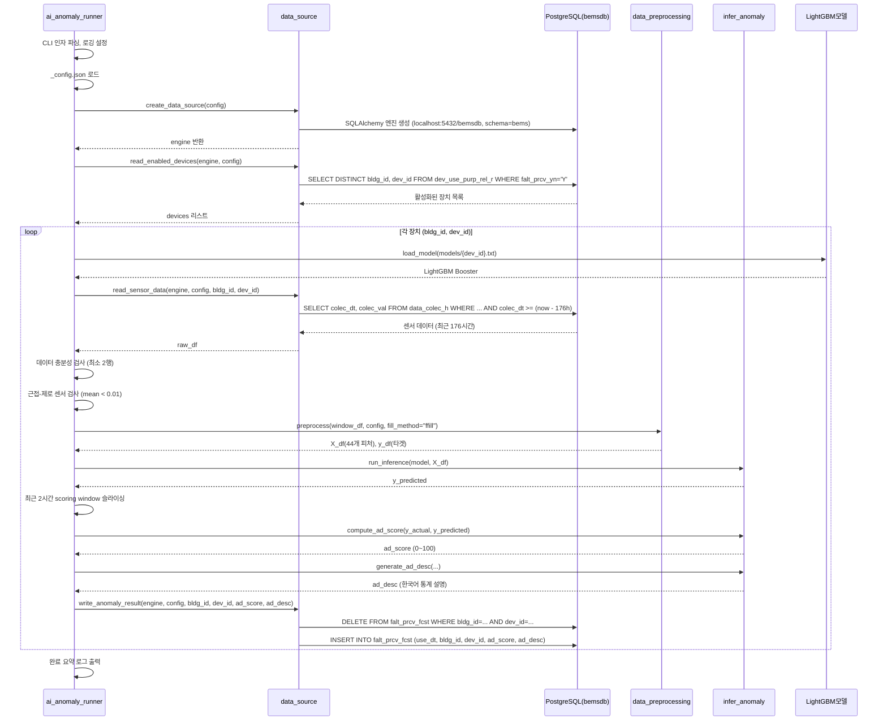
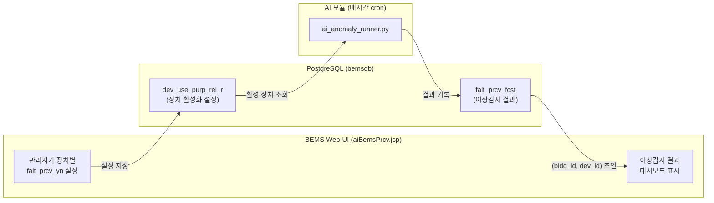

# ai_anomaly_runner.py 실행 흐름 분석

> 분석일: 2026-02-21
> 대상: `python3 anomaly_detection/ai_anomaly_runner.py`

## 실행 모드

두 가지 모드로 실행 가능하며, **인자 없이 실행하면 DB 모드(운영)**가 기본입니다.

```bash
python3 anomaly_detection/ai_anomaly_runner.py          # DB 모드 (운영)
python3 anomaly_detection/ai_anomaly_runner.py --csv    # CSV 모드 (개발)
```

---

## 전체 실행 흐름 (Sequence Diagram)



---

## 단계별 상세 설명

### 1단계: 초기화 (ai_anomaly_runner.py 148~173행)

- CLI 인자 파싱: `--csv` 플래그 여부 확인
- 로깅 설정: `INFO` 레벨, 타임스탬프 포맷
- `_config.json` 로드
- `data_source` 모드 결정: 인자 없으면 `"db"`, `--csv`면 `"csv"`
- SQLAlchemy 엔진 생성 (DB 모드): `localhost:5432/bemsdb`, schema=`bems`, user=`ai`

### 2단계: 활성 장치 조회 (data_source.py 84~127행)

- **DB 모드**: `bems.dev_use_purp_rel_r` 테이블에서 `falt_prcv_yn = 'Y'`인 장치 조회
- **CSV 모드**: `config_anomaly_devices.csv`에서 `FALT_PRCV_YN = 'Y'`인 장치 필터링
- 현재 CSV 설정에서는 DEV_ID **2002, 2003, 2024, 2025** 총 4개 장치가 활성화 상태

### 3단계: 장치별 처리 루프 (ai_anomaly_runner.py 52~145행)

각 활성 장치에 대해 순차적으로 아래를 수행:

#### 3-1. 모델 로드

- 경로: `anomaly_detection/models/{dev_id}.txt` (LightGBM Booster 텍스트 파일)
- 모델 파일 없으면 해당 장치 **skip**

#### 3-2. 센서 데이터 읽기

- **DB 모드**: `bems.data_colec_h` 테이블에서 조건부 SELECT
  - 조건: `bldg_id`, `dev_id`, `tag_cd=30001`, `colec_dt >= (현재 - 176시간)`
- **CSV 모드**: 4.3GB CSV 파일을 50만 행 단위 chunk 읽기로 필터링
- 반환: `colec_dt`, `colec_val` 2개 컬럼의 DataFrame

#### 3-3. 데이터 검증

- **최소 행 수 검사**: 2행 미만이면 skip
- **근접-제로 센서 검사**: 최근 scoring window(2시간=8포인트)의 `mean(|값|) < 0.01`이면
  - `ad_score = 100.0` (정상), 설명 = "센서 제로" 로 바로 결과 기록 후 skip
  - 유휴 센서에 대한 오탐(false positive) 방지 목적

#### 3-4. 전처리 (data_preprocessing.py)

- 15분 간격으로 리샘플링
- 결측값 forward-fill
- **44개 시계열 피처** 생성:
  - 시간적 피처 (hour, month, weekday, is_holiday)
  - 계절성 피처 (sin/cos 인코딩)
  - 래그 피처 (1~3 주기, 1일, 1주)
  - 변화율 피처 (1차, 2차 미분)
  - 롤링 통계 (1시간, 1일 윈도우의 평균/최대/최소/표준편차)
  - 전일/전주 대비 통계
  - 계절 분해 피처

#### 3-5. 추론 및 점수 산출 (infer_anomaly.py)

- LightGBM 모델로 전체 구간 예측 수행
- **최근 2시간(8포인트)**만 슬라이싱하여 점수 산출
- **AD_SCORE 산출 공식**: `score = max(0, 100 - (RMSE / mean(|실측값|)) * 100)`
  - 100점 = 완벽 일치 (정상)
  - 50점 이하 = 이상 상태 (기본 threshold)
- **ad_desc 생성**: 한국어 통계 요약 텍스트 (최대 1000자)
  - 예: `"정상 상태 | 2H 평균 | 정상지수: 85.3 | RMSE: 12.45 | 평균: 82.10, 표준편차: 5.32, 최대: 95.20, 최소: 70.15"`

#### 3-6. 결과 저장 (data_source.py 244~317행)

- **DB 모드**: `bems.falt_prcv_fcst` 테이블에 DELETE + INSERT (장치당 항상 1건만 유지)
- **CSV 모드**: `output/anomaly_results.csv`에 append + 콘솔 출력

### 4단계: 완료 요약

- 처리 성공 장치 수 / 전체 장치 수
- 소요 시간 (초)

---

## 관련 DB 테이블 (schema: bems)

### 읽기 테이블

| 테이블 | 용도 | AI 모듈 사용 방식 |
|--------|------|-------------------|
| `dev_use_purp_rel_r` | 장치 설정 (사용자 Web-UI에서 설정) | `falt_prcv_yn='Y'`인 장치 목록 조회 |
| `data_colec_h` | BEMS 센서 수집 데이터 | `tag_cd=30001`, 최근 176시간 데이터 읽기 |

### 쓰기 테이블

| 테이블 | 용도 | AI 모듈 사용 방식 |
|--------|------|-------------------|
| `falt_prcv_fcst` | 이상감지 예측 결과 | 장치당 1건 유지 (DELETE + INSERT) |

### falt_prcv_fcst 테이블 스키마 (PK: use_dt, bldg_id, dev_id)

| 컬럼 | 타입 | 설명 |
|------|------|------|
| `use_dt` | timestamp | 분석 수행 시각 |
| `bldg_id` | varchar(10) | 건물 ID (예: B0019) |
| `dev_id` | varchar(10) | 장치 ID (예: 2002) |
| `ad_score` | numeric(15,2) | 정상지수 (0~100, 50 이하 = 이상) |
| `ad_desc` | varchar(1000) | 한국어 통계 설명 텍스트 |

---

## 사용자 UX 관점

### BEMS 플랫폼 Web-UI 연동 흐름



1. **관리자 설정 (입력)**: BEMS 플랫폼 Web-UI에서 관리자가 장치별로 `falt_prcv_yn = 'Y'`를 설정하면, `dev_use_purp_rel_r` 테이블에 저장됨
2. **AI 자동 실행**: `ai_anomaly_runner.py`가 매시간 cron으로 실행되어, 활성화된 장치만 골라서 이상감지 수행
3. **결과 표시 (출력)**: BEMS Web-UI(`aiBemsPrcv.jsp`)가 `falt_prcv_fcst` 테이블을 `(bldg_id, dev_id)`로 조인하여 대시보드에 표시
   - 장치당 항상 **최신 1건만** 존재하므로 UI에서 정상 표시됨
   - `ad_score > 50` 이면 **"정상 상태"**, `ad_score <= 50` 이면 **"이상 상태"**로 표시
   - `ad_desc` 컬럼의 한국어 통계 요약이 상세 정보로 노출됨

---

## 핵심 설정값 요약 (_config.json)

| 설정 키 | 값 | 설명 |
|---------|-----|------|
| `fetch_window_hours` | 176 | 약 7일 + 8시간 (피처 엔지니어링용 넓은 윈도우) |
| `scoring_window_hours` | 2 | 최근 2시간만 점수 산출에 사용 |
| `sampling_minutes` | 15 | 15분 간격 데이터 |
| `tag_cd` | 30001 | 전력 데이터 태그 |
| `score_threshold` | 50 | 이상 판단 기준점 |
| `model_dir` | "models" | LightGBM 모델 저장 경로 |

---

## 요약

`ai_anomaly_runner.py`는 **BEMS 센서 이상감지 파이프라인의 메인 실행기**입니다. 매시간 cron으로 실행되어, 사용자가 Web-UI에서 활성화한 장치들에 대해 최근 176시간의 센서 데이터를 가져와 44개 시계열 피처를 생성하고, 장치별 LightGBM 모델로 예측한 뒤, 최근 2시간의 RMSE 기반 정상지수(0~100)를 산출합니다. 결과는 DB에 장치당 1건만 유지(DELETE+INSERT)되며, BEMS Web-UI 대시보드에서 실시간 이상 상태를 표시하는 데 사용됩니다.
