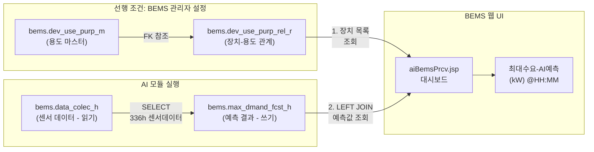
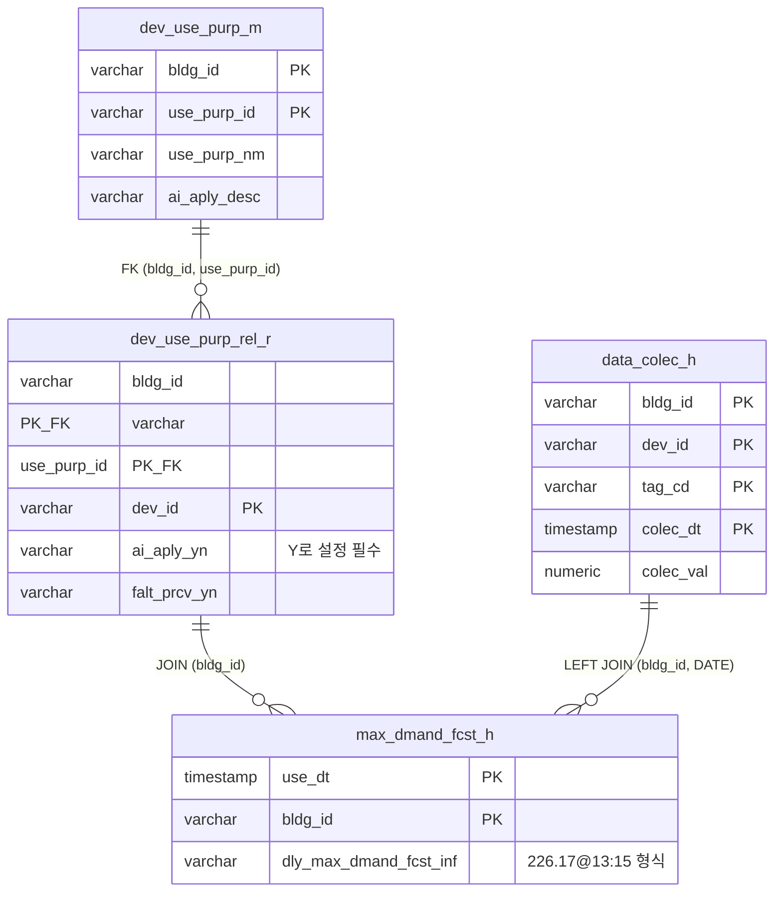

# "최대수요-AI예측(kW) @HH:MM" 열 표시를 위한 DB 테이블/필드 분석

- **작성일**: 2026-02-21
- **작성자**: AI 개발팀
- **목적**: BEMS 웹 UI의 "최대수요-AI예측(kW) @HH:MM" 열에 값이 출력되기 위해 필요한 DB 테이블 3종과 각 필드의 역할, 데이터 흐름을 소스 코드 수준에서 분석

---

## 1. 전체 데이터 흐름



---

## 2. 필요한 DB 테이블 3종 (+ 센서 데이터 1종)

---

### 테이블 1: `bems.dev_use_purp_m` (장치사용용도기본) -- 선행 설정 필수

**역할**: 건물별 "용도" 마스터 정보. 웹 UI에서 장치-용도 관계를 등록하기 위한 부모 테이블.

**스키마** (PK: `bldg_id, use_purp_id`):

| 컬럼 | 타입 | PK | NULL | 설명 |
|------|------|-----|------|------|
| `bldg_id` | varchar(10) | PK | NOT NULL | 건물 ID (예: `'B0019'`) |
| `use_purp_id` | varchar(10) | PK | NOT NULL | 사용용도 ID (BEMS 플랫폼 체계에 따름) |
| `use_purp_nm` | varchar(50) | | NULL | 사용용도명 (예: `'최대수요예측'`) |
| `ai_aply_desc` | varchar(1000) | | NULL | AI 적용 설명 |

**소스 근거**: `dataset/PostgreSQL_DB_design_concept.tsv` 8~13행

**필요 데이터 예시**:

```sql
INSERT INTO bems.dev_use_purp_m (bldg_id, use_purp_id, use_purp_nm, ai_aply_desc)
VALUES ('B0019', '{use_purp_id}', '최대수요예측', 'AI 최대수요 예측');
```

> `use_purp_id` 값은 BEMS 플랫폼 개발팀에 확인 필요 -- 웹 UI JSP가 특정 값을 기대할 수 있음.

---

### 테이블 2: `bems.dev_use_purp_rel_r` (장치사용용도관계) -- 선행 설정 필수

**역할**: 건물-장치-용도 간 관계를 정의. **웹 UI가 대시보드 렌더링 시 이 테이블을 기준으로 표시할 장치 목록을 먼저 결정함**. 이 테이블이 비어있으면 웹 UI에 아무것도 표시되지 않음.

**스키마** (PK: `bldg_id, use_purp_id, dev_id`):

| 컬럼 | 타입 | PK/FK | NULL | 설명 |
|------|------|-------|------|------|
| `bldg_id` | varchar(10) | PK, FK | NOT NULL | 건물 ID |
| `use_purp_id` | varchar(10) | PK, FK | NOT NULL | 사용용도 ID (FK → dev_use_purp_m) |
| `dev_id` | varchar(10) | PK | NOT NULL | 장치 ID (예: `'2001'`) |
| `forec_base_qnt` | numeric(15,2) | | NULL | 예상소비량 |
| `forec_rduc_qnt` | numeric(15,2) | | NULL | 예상절감량 |
| `falt_prcv_yn` | varchar(1) | | NULL | 이상감지 여부 (`'Y'`/`'N'`) |
| **`ai_aply_yn`** | varchar(1) | | NULL | **AI 적용 여부 (`'Y'` 필수)** |
| `lnch_st_time` | varchar(5) | | NULL | 점심시작시간 |
| `lnch_ed_time` | varchar(5) | | NULL | 점심종료시간 |
| `cool_base_tempr` | numeric(10,2) | | NULL | 냉방기준온도 |
| `heat_base_tempr` | numeric(10,2) | | NULL | 난방기준온도 |

**소스 근거**: `dataset/PostgreSQL_DB_design_concept.tsv` 16~28행

**핵심 필드**: `ai_aply_yn = 'Y'` -- 웹 UI가 AI 예측 컬럼을 표시할지 결정하는 플래그

**필요 데이터 예시**:

```sql
INSERT INTO bems.dev_use_purp_rel_r
  (bldg_id, use_purp_id, dev_id, ai_aply_yn, falt_prcv_yn)
VALUES
  ('B0019', '{use_purp_id}', '2001', 'Y', 'N');
```

**웹 UI 연동 방식**: `aiBemsPrcv.jsp`가 대시보드를 렌더링할 때:

1. `dev_use_purp_rel_r`에서 `ai_aply_yn = 'Y'`인 `(bldg_id, dev_id)` 목록 조회
2. 이 목록을 기준으로 `max_dmand_fcst_h`와 JOIN하여 예측값 표시
3. **이 테이블에 행이 0건이면 JOIN 결과도 0건 → 화면 비어있음**

---

### 테이블 3: `bems.max_dmand_fcst_h` (최대수요예측이력) -- AI 모듈이 자동 기록

**역할**: AI 모듈(`ai_peak_runner.py`)이 예측 결과를 저장하는 테이블. 웹 UI가 이 테이블에서 "최대수요-AI예측(kW) @HH:MM" 값을 읽어 표시.

**스키마** (PK: `use_dt, bldg_id`):

| 컬럼 | 타입 | PK | NULL | 설명 |
|------|------|-----|------|------|
| `use_dt` | timestamp | PK | NOT NULL | 사용일시 (예측 실행 시각) |
| `bldg_id` | varchar(10) | PK | NOT NULL | 건물 ID |
| **`dly_max_dmand_fcst_inf`** | varchar(30) | | NULL | **일일 최대수요 예측정보 (예: `"226.17@13:15"`)** |

**핵심 필드**: `dly_max_dmand_fcst_inf` -- `"226.17@13:15"` 형식으로 저장

- `@` 앞: 예측 최대수요 전력 (kW 단위) → 웹 UI "kW" 부분
- `@` 뒤: 예측 피크 발생 시각 (HH:MM) → 웹 UI "@HH:MM" 부분

**소스 근거**: `peak_prediction/data_source.py` 211~252행

**AI 모듈의 DB 기록 로직** (`write_peak_result()`):

```python
delete_sql = text(
    f"DELETE FROM {table} "
    f"WHERE bldg_id = :bldg_id AND DATE(use_dt) = DATE(:use_dt)"
)
insert_sql = text(
    f"INSERT INTO {table} (use_dt, bldg_id, dly_max_dmand_fcst_inf) "
    f"VALUES (:use_dt, :bldg_id, :peak_info)"
)
```

- 하루에 1건만 유지 (DELETE+INSERT 패턴)
- 매시간 cron 실행 시 오늘 날짜 기존 행 삭제 후 최신 예측값 INSERT

**웹 UI의 예측값 조회 SQL** (추정, `peak_prediction/docs/ai_peak_runner_db_mode_operation.md` 199~213행):

```sql
SELECT f.dly_max_dmand_fcst_inf AS AI예측
FROM bems.data_colec_h d
LEFT JOIN bems.max_dmand_fcst_h f
       ON d.bldg_id = f.bldg_id
      AND DATE(d.colec_dt) = DATE(f.use_dt)
WHERE d.bldg_id = 'B0019' AND d.dev_id = '2001' AND d.tag_cd = '30001'
```

`dly_max_dmand_fcst_inf = "226.17@13:15"` 가 `@` 기준으로 파싱되어 "226.17 kW @13:15"로 표시됨.

---

### (참고) 테이블 4: `bems.data_colec_h` (데이터수집이력) -- 센서 원천 데이터

**역할**: BEMS 플랫폼이 자동 수집하는 15분 간격 센서 데이터. AI 모듈이 읽기 전용으로 사용.

**스키마** (PK: `bldg_id, dev_id, tag_cd, colec_dt`):

| 컬럼 | 타입 | PK | NULL | 설명 |
|------|------|-----|------|------|
| `bldg_id` | varchar(10) | PK | NOT NULL | 건물 ID |
| `dev_id` | varchar(10) | PK | NOT NULL | 장치 ID |
| `tag_cd` | varchar(8) | PK | NOT NULL | 태그 코드 (`'30001'` = 전력) |
| `colec_dt` | timestamp | PK | NOT NULL | 수집일시 |
| `colec_val` | numeric(15,2) | | NULL | 수집값 (kW) |
| `reg_dt` | timestamp | | NULL | 등록일시 |

AI 모듈은 `tag_cd = '30001'` 조건으로 최근 336시간(14일) 데이터를 조회.

---

## 3. 테이블 간 관계 (ER)



---

## 4. 현재 상태 및 필요 조치 요약

| 항목 | 상태 | 비고 |
|------|------|------|
| `bems.data_colec_h` | **정상** | BEMS 플랫폼이 자동 수집 중, 4030건 확인 |
| `bems.max_dmand_fcst_h` | **정상** | AI 모듈이 `226.17@13:15` 기록 완료 |
| `bems.dev_use_purp_m` | **0건** | 용도 마스터 등록 필요 |
| `bems.dev_use_purp_rel_r` | **0건** | 장치-용도 관계 등록 및 `ai_aply_yn='Y'` 설정 필요 |
| BEMS 웹 UI 표시 | **실패** | JOIN 대상 테이블이 비어있음 |

웹 UI가 `dev_use_purp_rel_r` 테이블을 기준으로 표시할 장치 목록을 먼저 결정하므로, 이 테이블이 비어있으면 `max_dmand_fcst_h`에 데이터가 있더라도 화면에 표시되지 않습니다.

---

## 5. 필수 확인 사항

`use_purp_id` 값은 BEMS 플랫폼 개발팀에 확인 필요합니다. 웹 UI JSP(`aiBemsPrcv.jsp`)가 특정 `use_purp_id` 값(예: `'PEAK'`, `'P001'` 등)을 하드코딩하고 있을 수 있으며, 이 값이 일치하지 않으면 여전히 표시되지 않습니다. JSP 소스는 `/home/sems/tomcat8/webapps/zems/WEB-INF/view/ai/` 경로에 있으나 현재 권한 제한으로 직접 확인이 불가합니다.
